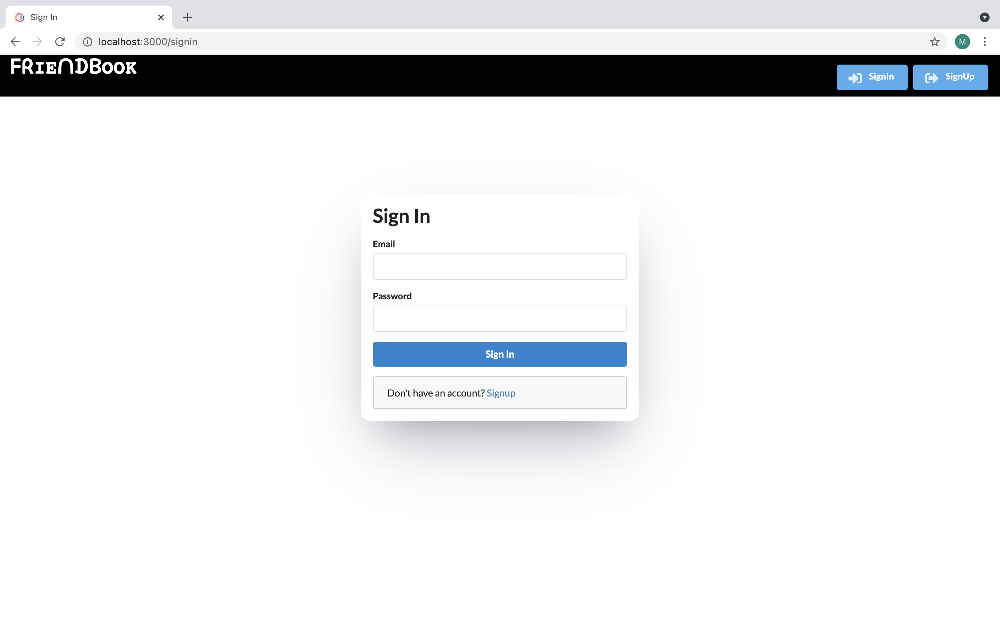
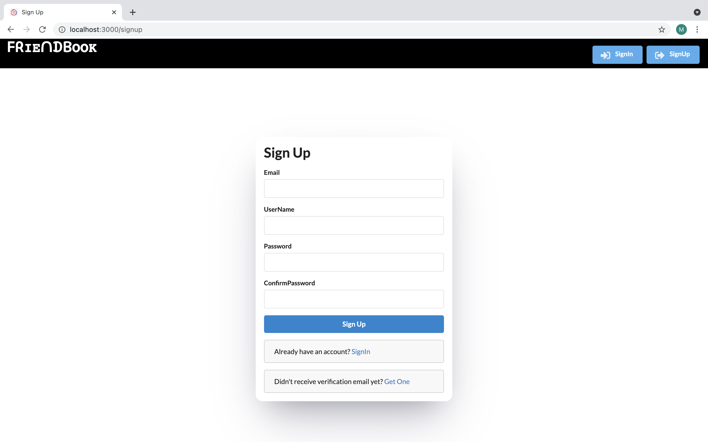
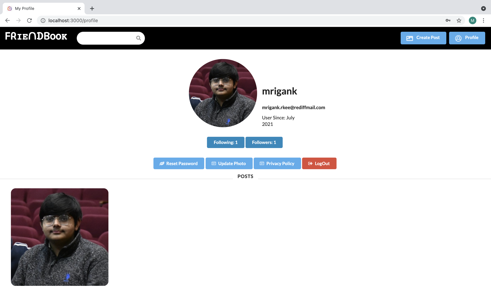
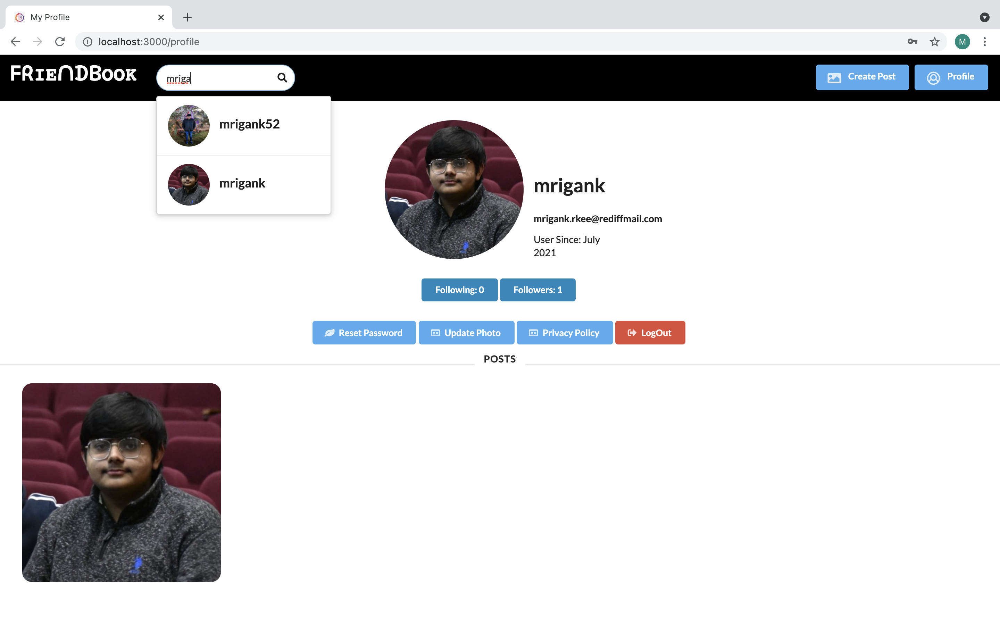
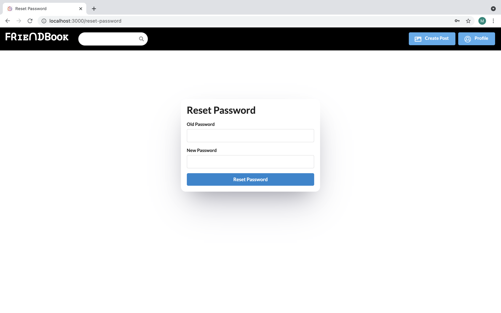
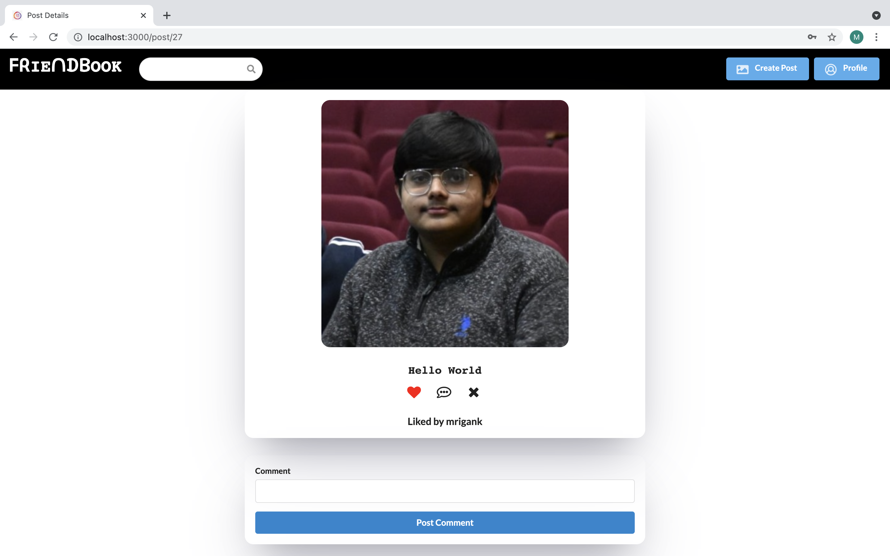
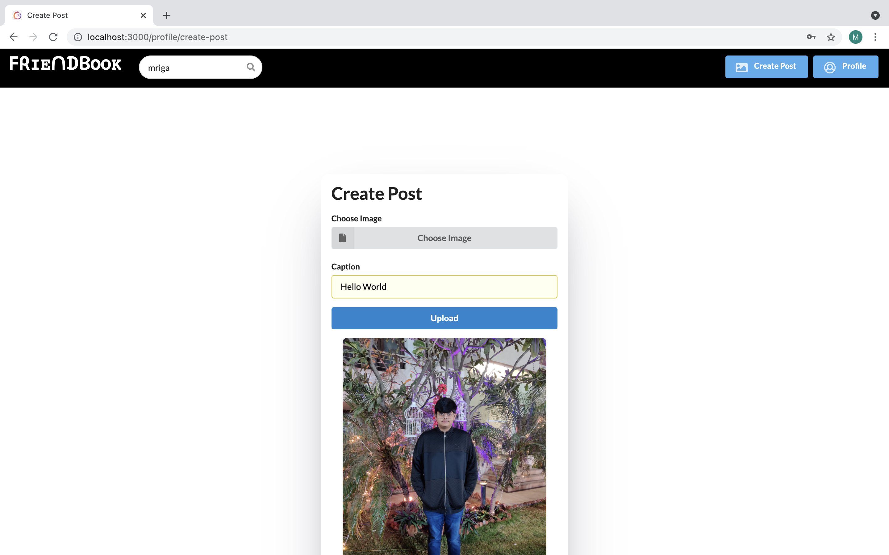
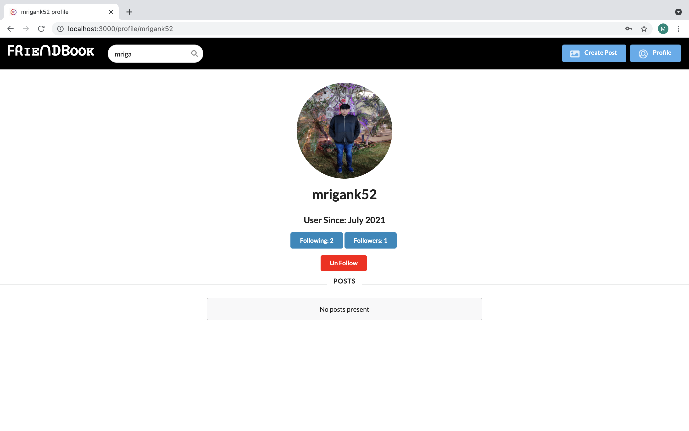
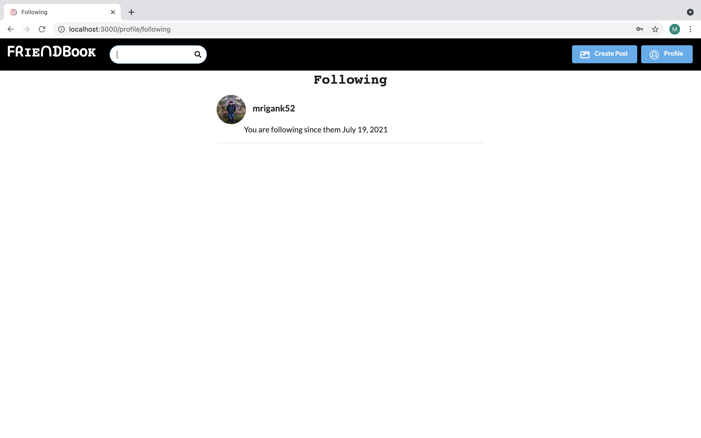

# Friend-Book Application
Tech Stack
- Next.js
- React.js
- Django REST Framework (for backend)

Features:

- SignIn/ SignUp
- Create Posts
- Like, Comment and delete Posts
- View other users profile
- Update Profile Photo
- Follow and unfollow other users
- Reset Password
- View all Posts
- Search for users

## Run the project

First, run the development server:

```bash
npm run dev
# or
yarn dev
```

Open [http://localhost:3000](http://localhost:3000) with your browser to see the result.

Start the backend server at post `8000`

Link to backend [repository](https://github.com/spiderxm/friend-book-backend)

Authentication implemented using Token based Authentication

# SignIn



# SignUp



# Profile



# Search



# Reset Password



# Post Details



# Create Post



# Other User Profile - Followed them



# Check out whom you follow


### Made by [Mrigank Anand](https://github.com/spiderxm)